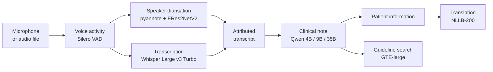
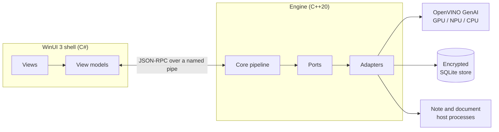

<div align="center">

# ClinicAVT

**On-device ambient voice technology for clinical consultations**

Records the consultation, identifies who spoke, drafts the clinical note and patient
information, then retrieves the relevant clinical guidance.


</div>

---

ClinicAVT was developed as an MSc project at UCL in collaboration with Intel and the NHS. It is a
research prototype for evaluation and demonstration: every draft must be checked by a clinician
before use.

## Features

- **Private by design.** All models run on the device. No audio, text or usage data leaves the computer, and audio is discarded once processed.
- **Speaker-attributed transcripts.** Speech is transcribed with Whisper and each turn is attributed to the clinician or the patient. Optional voice enrolment improves attribution over time.
- **Clinical notes.** Structured notes in SOAP or narrative form, at two lengths, from a choice of three local language models sized to the hardware.
- **Patient information.** A plain-English summary for the patient, written to a UK reading age of about 8, with translation into 24 languages including right-to-left scripts.
- **Guideline references.** Local guideline documents are indexed and searched against each consultation, with the relevant passages shown beside the note.
- **Appraisal reflections.** Consultations can be summarised and reflected on for appraisal, then exported as text.
- **Encrypted storage and backups.** Saved consultations are encrypted at rest. Password-protected backups can hold full consultations or reflections only.
- **Recording import.** Existing audio files can be imported, and four example consultations are bundled for demonstration.

## How it works



Transcription and note generation run on the integrated Intel GPU, with transcription optionally on
the NPU. The smaller models run on the CPU. Every model runs through OpenVINO, and the larger ones
use 8-bit or 4-bit weights.

## Architecture



The engine follows a ports-and-adapters design and has no dependency on the shell, so each half is
built and tested independently. Note generation and document parsing run in separate host
processes, which keeps a fault in either away from the recording.

## Models

| Task | Model | Precision | Device |
|---|---|---|---|
| Speech recognition | Whisper Large v3 Turbo | INT8 | GPU or NPU |
| Voice activity | Silero VAD | FP32 | CPU |
| Speaker segmentation | pyannote segmentation 3.0 | FP32 | CPU |
| Speaker identification | ERes2NetV2 | INT8 | CPU |
| Note writing | Qwen3.5 4B, Qwen3.5 9B, Qwen3.6 35B-A3B | INT4 | GPU |
| Translation | NLLB-200 distilled 600M | INT8 | CPU |
| Guideline search | GTE-large | INT8 | CPU |

The note model is chosen automatically: the 9B on computers with enough memory, otherwise the 4B.
The 35B is available in Settings for high-memory systems.

## Requirements

- Windows 11, 64-bit
- Intel Core Ultra Series 2 or later with Intel Arc graphics
- 16 GB RAM (24 GB for the 9B note model, 32 GB for the 35B)
- 40 GB free disk space

## Getting started

1. Update the Intel graphics driver and, in Intel Graphics Software, set **Shared GPU Memory
   Override** to the maximum.
2. Download and extract a release, then open `ClinicAVT.exe`.
3. To try it without recording, choose **Import the file** and select an example consultation.

The first launch compiles the models for the computer's graphics hardware, which takes a few
minutes once. Releases come in two sizes: a full build with all three note models, and a smaller
build with the 4B model only.

<details>
<summary><strong>Building from source</strong></summary>

Requires Visual Studio 2022 or 2026 with the **Desktop development with C++** workload and the
.NET 10 SDK. From a developer command prompt in the repository root:

```powershell
# Toolchain: pinned OpenVINO GenAI and PDFium, hash-checked, installed under external\
powershell tools\get-openvino.ps1
powershell tools\get-pdfium.ps1

# Engine
cmake --preset release
cmake --build --preset release

# Models: the standard note model and example recordings, then the optional 4B and 35B packs
cmake --build --preset release --target fetch-models
dotnet run --project tools\ClinicAVT.FetchModels -c Release -- fetch weights\tiers\constrained .
dotnet run --project tools\ClinicAVT.FetchModels -c Release -- fetch weights\tiers\accuracy .

# Shell
dotnet build clinicavt.slnx -p:Platform=x64
```

Or open `clinicavt.slnx` in Visual Studio, set `ClinicAVT.App` as the startup project with the x64
platform, and run. The shell always uses the release engine, since a debug engine distorts timings.
To produce a release folder, run `tools\stage-release.ps1`; add `-SmallNoteModel` for the 4B-only
build.

</details>

<details>
<summary><strong>Testing</strong></summary>

```powershell
cmake --workflow --preset dev
dotnet test clinicavt.slnx --filter "Requires!=Engine&Requires!=EngineSlow&Requires!=CrashBattery"
```

The first command builds the engine and runs its tests. The second runs the C# tests that need no
engine, with view models tested against fakes at the ports. Tests marked `Requires=Engine` start the
built engine; the real-time replay (`EngineSlow`) and crash tests (`CrashBattery`) run through
`tools\run-gates.ps1`.

</details>

## Repository layout

```
ClinicAVT/
├── engine/                      C++20 engine
│   ├── src/
│   │   ├── core/                pure pipeline logic, one folder per stage
│   │   │   ├── audio/           capture ring, level metering and voice enrolment
│   │   │   ├── diarisation/     speaker turns, per-turn decoding and role naming
│   │   │   ├── note/            note gating, labelling and failure handling
│   │   │   ├── guidance/        guideline retrieval and ranking
│   │   │   ├── translate/       patient information translation
│   │   │   ├── archive/         backup and restore
│   │   │   └── session/         consultation lifecycle, import and the note lane
│   │   ├── ports/               interfaces the core depends on
│   │   ├── adapters/            implementations: OpenVINO models, audio, storage, IPC
│   │   ├── engine_main.cpp      engine process
│   │   ├── note_host_main.cpp   isolated note-generation process
│   │   └── ingest_host_main.cpp isolated PDF parsing process
│   ├── tests/                   GoogleTest suites mirroring src/
│   ├── tools/                   guideline corpus builder
│   └── licences/                third-party notices shipped with the app
├── app/                         .NET 10 shell
│   ├── ClinicAVT.App/           WinUI 3 views, themes and controls
│   ├── ClinicAVT.App.Core/      view models, one folder per feature, no WinUI dependency
│   ├── ClinicAVT.App.Platform/  Win32 adapters
│   ├── ClinicAVT.Client/        typed JSON-RPC client for the engine
│   └── *.Tests/                 xUnit suites for each project
├── launcher/                    ClinicAVT.exe, which starts the app from a release folder
├── eval/                        evaluation suites
│   ├── asr/                     transcription accuracy
│   ├── diarisation/             speaker attribution
│   ├── summarisation/           note quality, including the LLM judge
│   ├── retrieval/               guideline search
│   ├── translation/             translation quality
│   └── performance/             latency and memory across note models
├── schema/fixtures/             example wire messages shared by engine and shell tests
├── prompts/                     note and patient information prompts
├── demo/                        example consultations (PriMock57)
├── weights/                     model pack manifests with SHA-256 hashes
├── tools/                       toolchain, model fetching and release staging scripts
├── CMakeLists.txt               engine and launcher build
└── clinicavt.slnx               shell solution
```

`engine/src/README.md` and `app/README.md` describe each half in more detail.

## Licence

The source code is released under the [MIT Licence](LICENSE). Model weights and third-party
libraries keep their own licences, listed in `engine/licences/THIRD-PARTY-NOTICES.txt` and on the
application's About page. The NLLB-200 translation model is licensed for non-commercial use only.

Copyright © 2026 Philip Hargreaves.
